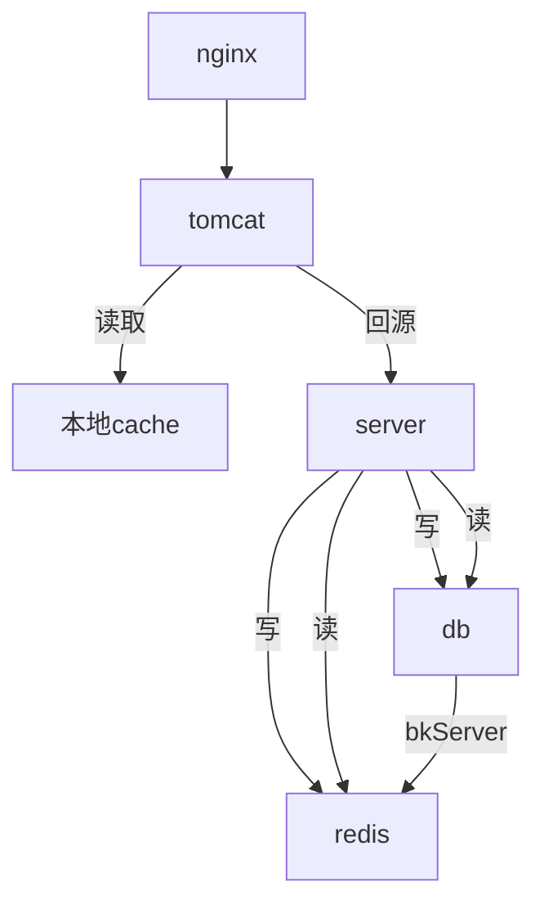

# Redis介绍

### 目的
>* 能够对redis有粗略的理解，并且能够在开发中运用得到；
>* redis的常用命令介绍
>* 介绍我们系统中有哪几种使用redis的方式
>* 缓存类问题定位方法
>* 更多知识
***
### redis的优点：
1. 速度快，因为数据存在内存中；
2. 支持丰富数据类型，支持string，list，set，sorted set，hash；
3. 支持事务，操作都是原子性，所谓的原子性就是对数据的更改要么全部执行，要么全部不执行(multi,exec)；
4. 丰富的特性：可用于缓存，消息，按key设置过期时间，过期后将会自动删除；
5. 提供了两种持久化方式（AOF，RDB）；
6. 支持lua脚本，配合lua脚本能够执行复杂的查询操作；
##### RDB（Redis DataBase默认）
> 持久化可以在指定的时间间隔内生成数据集的时间点快照（point-in-time snapshot）将dump.rdb保存到文件当中。
###### 优点：
1. 能够回滚到上一个时间点的数据
2. 能够通过传递rdb文件来实现各个redis数据恢复
3. RDB 可以最大化 Redis 的性能：父进程在保存 RDB 文件时唯一要做的就是 fork 出一个子进程，然后这个子进程就会处理接下来的所有保存工作，父进程无须执行任何磁盘 I/O 操作。
4. RDB 在恢复大数据集时的速度比 AOF 的恢复速度要快。
5. 在写入rdb文件时，会先创建临时文件，写完后才改名为dump.rdb，这样出现问题时，至少能回退到上一个rdb
###### 缺点：
1. 数据丢失，由于RDB是定时记录的快照，在生成快照之前的时候出现故障，会丢失数据
2. 如果执行了flushall或者什么命令，他通过快照就不能回滚到指定操作了
##### AOF (Append-only file)
> 持久化记录服务器执行的所有写操作命令，并在服务器启动时，通过重新执行这些命令来还原数据集。
AOF 文件中的命令全部以 Redis 协议的格式来保存，新命令会被追加到文件的末尾。
Redis 还可以在后台对 AOF 文件进行重写（rewrite），使得 AOF 文件的体积不会超出保存数据集状态所需的实际大小。
###### 优点
1. 保持更高的数据完整性，always（每次命令都记录） everysec（每秒记录，默认） no（根据操作系统去判断多久记录一次）
2. 当出现问题导致命令没有完整写入文件时，也能通过redis-check-aof来修复
3. AOF文件体积变大时，会自动重写文件，整个重写过程绝对安全，不会影响aof文件的写入
4. aof文件可以读，当执行了一些误操作，可以通过删除这个操作来恢复数据
###### 缺点
1. 持久化相同数量的数据时 aof文件体积大于rdb的体积
2. aof比rdb更消耗性能
3. 如果使用默认设置时，每秒fsync（同步内存中所有已修改的文件数据到储存设备）,依然会丢1秒的数据
##### Redis 还可以同时使用 AOF 持久化和 RDB 持久化。
> 在这种情况下， 当 Redis 重启时， 它会优先使用 AOF 文件来还原数据集， 因为 AOF 文件保存的数据集通常比 RDB 文件所保存的数据集更完整。你甚至可以关闭持久化功能，让数据只在服务器运行时存在。
***
### redis的常用命令介绍
1. keys：查找所有符合给定模式 pattern 的 key 。 如 keys *gray* 查询带有gray的key，并返回
2. type：返回 key 所储存的值的类型。
3. eval：从 Redis 2.6.0 版本开始，通过内置的 Lua 解释器，可以使用 EVAL 命令对 Lua 脚本进行求值。
4. script load & evalsha ： script load把lua脚本加载到redis缓存中，并范围对应的脚本值，evalsha根据脚本值执行脚本
5. save & bgsave:直接保存/（异步）运行保存 当前redis的数据
6. 更多的命令请看 http://doc.redisfans.com/
***
### 我们系统中redis的用法
1. key-value缓存
2. 基于binlog机制更新缓存：这种情况下经常听到同事说缓存挂了，其实是kafka启动的时候，zookeeper还没启动，导致kafka启动失败，这个时候只需要重启kafka，再重启binlogKafkaServer就能正常使用；
但是再处理这个问题时，还是先看看binlogKafkaServer的日志，根据日志去具体分析问题
3. 灰度系统 详情请查看 http://wiki.oa.isuwang.com/pages/viewpage.action?pageId=3902268
4. 系统中搜索组件 通过lua脚本处理redis的缓存
5. pipeline 批量上传redis命令

#### 缓存的应用场景
##### 我们公司是这样的

***
### 开发中常见到的问题
1. 当生产中怀疑缓存出现问题的时候，但又不了解key的情况下，可以用以下命令查看：
keys *${key}*：模糊匹配类似的key
type： 查看key的类型
根据类型查看key的值；
2. 在测试环境中，经常出现缓存挂掉的情况，这个时候请优先查看binlogkafkaServer这个服务，看看log报的是什么错，
一般又两种可能：canal出错，有些时候canal会出错，这个时候直接rm掉容器，重新创建就可以了；
kafka挂掉，由于kafka启动的时候没有找到zookeeper，会出现启动失败的情况，这种情况出现几率较高，
此时应该进入kafka的bin 然后执行./kafka-server-start.sh ../config/server.properties &
退出容易重启binlogKafkaServer即可

3. 在进行缓存开发时，应该尽量在操作缓存的地方打日志，这样能够方便追踪定位问题。

4. 在代码中使用lua脚本时，应该使用loadscript命令获取SHA值，通过这个值使用evalsha命令调用脚本，能够有效降低带宽，提高效率；

5. 在进行缓存开发的时候，应该考虑尽可能一次性将数据存入redis，多使用批量操作，或使用pipline来减少与redis的交互，这样能极大的提高缓存效率；

6. 由于redis是单线程，在使用lua脚本时，应该考虑怎样提高命中率，提高效率

7. 以下情况是值得考虑使用缓存的：如跨表查询较多且表数据变化不多，或实时性要求不高的情况下，适合使用缓存，至于是否需要通过binlog去触发更新，应该考虑实时性，因为目前系统中binlog触发的缓存更新会有几秒的延迟，也有可能binlog数据量较大，处理效率很低，会延迟缓存生效的时间；

8. 目前权限方面更新还是比较缓慢，希望大家有时间能读一下那一块代码，提出优化建议；

### 更多知识
1. 随着并发量增加，redis读压力也增加，但是多数都是读操作，于是我们可以使用主从同步的方式解决这个问题，注意从redis关掉写入功能
2. 随着并发增加，redis写压力也增加，我们可以通过分片的方式，写入到不同的主redis，分片的工具有twitter的Twemproxy和豌豆荚的codis和redis自带的redis-cluster
