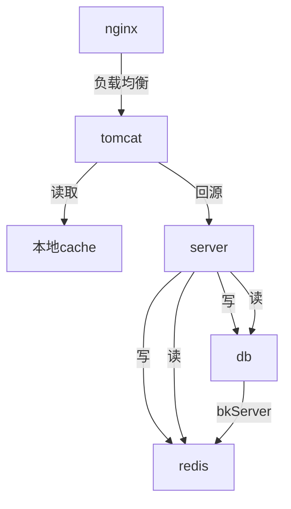

# 缓存介绍

### 什么是缓存？
1、Cache是高速缓冲存储器一种特殊的存储器子系统，其中复制了频繁使用的数据以利于快速访问

2、凡是位于速度相差较大的两种硬件/软件之间的，用于协调两者数据传输速度差异的结构，均可称之为
Cache

3、我们听得比较多的缓存有：ehcache，redis，memcache，mangodb等，本文只介绍redis；

### redis核心命令介绍；
#### redis的优点：
1. 速度快，因为数据存在内存中；
2. 支持丰富数据类型，支持string，list，set，sorted set，hash
3. 支持事务，操作都是原子性，所谓的原子性就是对数据的更改要么全部执行，要么全部不执行
4. 丰富的特性：可用于缓存，消息，按key设置过期时间，过期后将会自动删除
5. 提供了多种不同级别的持久化方式；
##### RDB（Redis DataBase默认）
持久化可以在指定的时间间隔内生成数据集的时间点快照（point-in-time snapshot）将dump.rdb保存到文件当中。
###### 优点：
1.能够回滚到上一个时间点的数据
2.能够通过传递rdb文件来实现各个redis数据恢复
3.RDB 可以最大化 Redis 的性能：父进程在保存 RDB 文件时唯一要做的就是 fork 出一个子进程，然后这个子进程就会处理接下来的所有保存工作，父进程无须执行任何磁盘 I/O 操作。
4.RDB 在恢复大数据集时的速度比 AOF 的恢复速度要快。
###### 缺点：
数据丢失，由于RDB是定时记录的快照，在生成快照之前的时候出现故障，会丢失数据
##### AOF (Append-only file)

持久化记录服务器执行的所有写操作命令，并在服务器启动时，通过重新执行这些命令来还原数据集。
AOF 文件中的命令全部以 Redis 协议的格式来保存，新命令会被追加到文件的末尾。
Redis 还可以在后台对 AOF 文件进行重写（rewrite），使得 AOF 文件的体积不会超出保存数据集状态所需的实际大小。
###### 优点

1.保持更高的数据完整性，always（每次命令都记录） everysec（每秒记录，默认） no（根据操作系统去判断多久记录一次）

2.当出现问题导致命令没有完整写入文件时，也能通过redis-check-aof来修复

3.AOF文件体积变大时，会自动重写文件，整个重写过程绝对安全，不会影响aof文件的写入

4.aof文件可以读，当执行了一些误操作，可以通过删除这个操作来恢复数据
###### 缺点
(1) 持久化相同数量的数据时 aof文件体积大于rdb的体积

(2) aof比rdb更消耗性能

(3) 如果使用默认设置时，每秒fsync（同步内存中所有已修改的文件数据到储存设备）,依然会丢1秒的数据
##### Redis 还可以同时使用 AOF 持久化和 RDB 持久化。

在这种情况下， 当 Redis 重启时， 它会优先使用 AOF 文件来还原数据集， 因为 AOF 文件保存的数据集通常比 RDB 文件所保存的数据集更完整。
你甚至可以关闭持久化功能，让数据只在服务器运行时存在。

#### redis命令介绍
(1).keys：查找所有符合给定模式 pattern 的 key 。 如 keys *gray* 查询带有gray的key，并返回

(2).type：返回 key 所储存的值的类型。

(3).eval：从 Redis 2.6.0 版本开始，通过内置的 Lua 解释器，可以使用 EVAL 命令对 Lua 脚本进行求值。

(4).script load & evalsha ： script load把lua脚本加载到redis缓存中，并范围对应的脚本值，evalsha根据脚本值执行脚本

(6).save & bgsave:直接保存/后台运行保存 当前redis的数据

(5).更多的命令请看 http://doc.redisfans.com/

#### 我们系系统中redis的用法
(1).key-value缓存

(2).基于binlog机制更新缓存：这种情况下经常听到同事说缓存挂了，其实是kafka启动的时候，
zookeeper还没启动，导致kafka启动失败，这个时候只需要重启kafka，再重启binlogKafkaServer就能正常使用；
但是再处理这个问题时，还是先看看binlogKafkaServer的日志，根据日志去具体分析问题

(3).灰度系统 详情请查看 http://wiki.oa.isuwang.com/pages/viewpage.action?pageId=3902268

(4).系统中搜索组件 通过lua脚本处理redis的缓存

(5).pipeline 批量上传redis命令

### 缓存的应用场景
######我们公司是这样的

### 关于redis的更多
1.一些问题，
